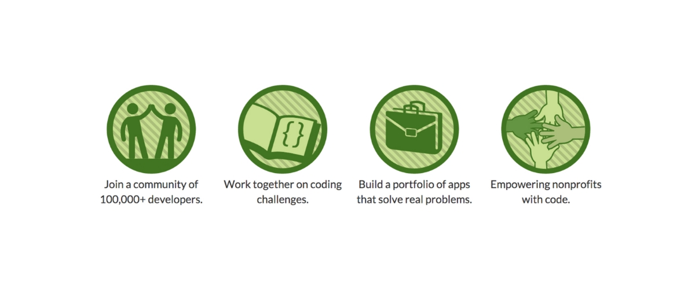

Not long ago I have started my [FreeCodeCamp](http://www.freecodecamp.com/lancelote)
path thanks to [smartprogress.do](https://smartprogress.do/goal/162912/) to
gain a better knowledge of frontend technology stack. I was somewhat sceptical
that time about my capabilities in the area ("I am not a designer - I'm an
engineer") and I did no like front end altogether. All that billions of
JS-related technologies and HTML with CSS on top of the cake, gosh! Time has passed
and I have catch myself today enjoining of frontend development. So, what is
happened to me? Not much in reality.

## Smartprogress

First of all, thanks Lord I found this website. It has pretty ugly layout, bad
translation and I really hate when something is broken there again, but it
value lies in different place. It has opened for me the importance of
collaboration with passionate people and how it can greatly motivate you
toward your goals. I do not call you to start using smartprogress but I call
you to start collaborate with people in any way you will find appropriate. It will
have dramatic effect on you live - trust me, solitude seems not be the best
choice in IT.

## FreeCodeCamp

Thanks to my new friends at smartprogress I have fond this gorgeous online learning
platform. It's fully free and has a great foundation idea ever - 'PRACTICE'! 
Yeap, "practise makes perfect", simple but powerful idea we forgot too
frequently. To gain maximum from this opportunity I have combined it with
the new learning style I have started to practise this year - little steps every day.
Push forward every day no matter how far. Let it be just a little code change
or a new book page - push forward! Step by step I have reached first FreeCodeCamp
project.

## Codepen.io

I was surprised of the project difficulty (that was a portfolio one).
Perhaps old me would never be able to finish it not even because
of it's complexity (in fact it is super easy) but due to my laziness or should
I say overwhelming of guides, tutorials, projects, podcasts and video typical
novice developer face every day. But I have started to work on it step by step and was
surprised how fast in fact everything starts to go. Here we have another
great platform I have started to use - [codepen.io](http://codepen.io/). It is simple
online front end playground. Great tools has a major impact not only on our
productivity but on our mental attitude and codepen helps me greatly - it's
really convenient and aspirational for beginner to see instantaneous effect
of his or her css tweaks. I encourage you to give this nice service a try, it's not only
an online editor but also a social platform for frontend developers +great blog
and podcast.

## First Project

So my first project is complete now. It is ultra simple one page
[Ayn Rand tribute](http://codepen.io/lancelote/full/OMqbMx/) and I really
enjoyed working on it. Personal Portfolio is 50% ready and I hope to complete
it soon and use here - current about page is too simple as for me.

## English

As always please excuse my poor English skill. I invest a lot of spare time in
developing my language proficiency, but it is still not awesome enough. I would
greatly appreciate any recommendation and corrections!
