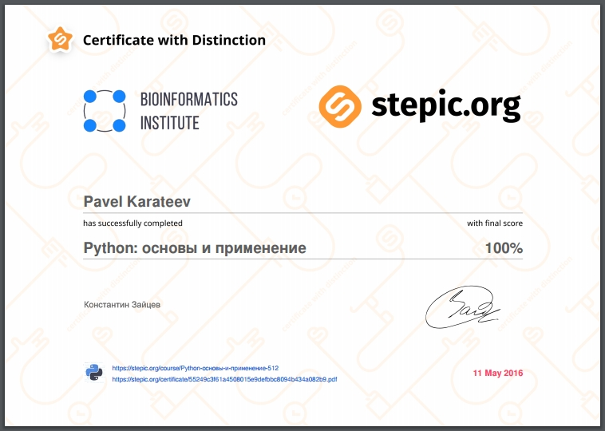

Завершил курс "[Python: основы и применение](https://stepic.org/course/Python-%D0%BE%D1%81%D0%BD%D0%BE%D0%B2%D1%8B-%D0%B8-%D0%BF%D1%80%D0%B8%D0%BC%D0%B5%D0%BD%D0%B5%D0%BD%D0%B8%D0%B5-512)"
от [Stepic.org](https://stepic.org/). Несмотря на название курс оказался весьма
интересным и не таким уж и базовым - полные новички в Python могут столкнуться с
проблемами. Мне очень понравилось, что были разобраны некоторые традиционно
пропускаемые вопросы (пресловутый Method Resolution Order), которые как раз очень
любят спрашивать на собеседованиях. Чуть подробнее о плюсах и минусах, а также
краткое содержание внутри.

## Содержание

- Базовые принипы языка Python
  - Модель данных: объекты
  - Функции и стек вызовов
  - Пространство имен и области видимости
  - Введение в классы
  - Наследование классов
- Стандартные средства языка Python
  - Ошибки и исключения
  - Работа с кодом: импорты и модули
  - Итераторы и генераторы
  - Работа с файловой системой и файлами
  - Работа с функциями: `functools` и лямбда функции
  - Стиль программирования: pep8 и документация
- Применение Python: анализ текста
  - Стандартные методы и функции для строк
  - Регулярные выражения в Python
  - Обзорно об интернете: http, html, `requests`
  - Форматы текстовых файлов: CSV, JSON
  - API
  - XML, библиотека ElementTree, библиотека `lxml`

## Плюсы

- Затронуты важные углубленные темы (MRO, namespaces)
- Хороший стартовый обзор стандартной библиотеки
- Интересные практические задания по работе с файлами, сетью и API

## Минусы (условные)

- Короткий (всего 3 модуля)
- Затронутые темы не объясняются подробно
- Не подходит для полных новичков

## Резюме

Отличный курс для тех кто прошел базовое обучение Python и теперь не знает
куда податься. Здесь еще раз пробегутся по важным особенностям языка и дадут
несколько хороших практических заданий, чтобы вы могли прочувствовать на что
способен язык.
